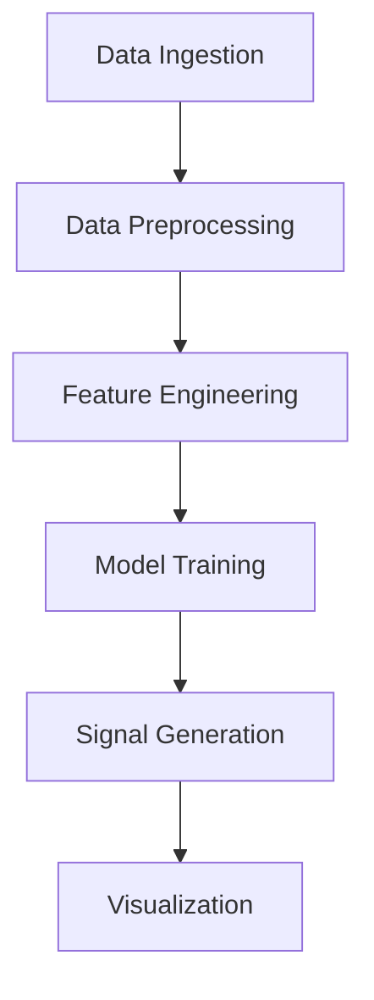

# AlgoTrade - Algorithmic Trading System


AlgoTrade is a machine learning-powered algorithmic trading system that generates buy/sell signals for BIST100 stocks and cryptocurrencies.

## Features

- **Real-time Data**: Fetches stock/crypto data using Yahoo Finance API
- **Machine Learning**: Decision Tree classifier for signal generation
- **Technical Indicators**: RSI, MACD, Bollinger Bands and more
- **Interactive Dashboard**: Streamlit web interface with:
  - Daily buy/sell signals
  - Price visualization
  - Prediction results
  - Portfolio simulation

## Installation

1. Clone the repository:
```bash
git clone https://github.com/salihburakgurhan/AlgoTrade.git
cd AlgoTrade
```

2. Install dependencies:
```bash
pip install -r requirements.txt
```

3. Run the application:
```bash
streamlit run main.py
```

## Usage

1. Select a stock or cryptocurrency from the dropdown
2. Choose date range using the slider
3. Click "Get Predictions" to see buy/sell signals
4. View portfolio simulation results


## Architecture



### Components

- **Data Pipeline**:
  - `data_ingestion.py`: Fetches market data
  - `data_preprocessing.py`: Cleans and transforms data
  - `feature_engineering.py`: Calculates technical indicators

- **ML Pipeline**:
  - `model_building.py`: Trains Decision Tree model
  - `model_evaluation.py`: Evaluates model performance

- **Web Interface**:
  - `main.py`: Streamlit dashboard
  - `app.py`: Core trading logic

## Configuration

Edit `constants.py` to:
- Add/remove stocks from `stock_list`
- Add/remove cryptocurrencies from `crypto_list`
- Adjust technical indicator parameters

## Disclaimer

⚠️ **This is not financial advice**  
AlgoTrade is a data science project for educational purposes only. Trading involves substantial risk of loss and is not suitable for all investors. Past performance is not indicative of future results.

## License

MIT License - See [LICENSE](LICENSE) for details
